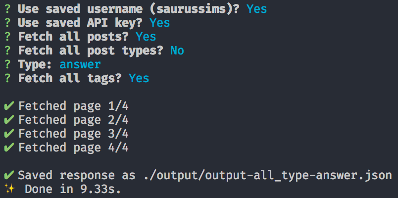

<h1 align="center">
    Fetch From Tumblr
</h1>
<br/>

<p align="center">
    A simple cli tool for fetching data<br />
    from the Tumblr API
</p>
<br/>

<p align="center">
    <a href="#why"><strong>Why?</strong></a> ·
    <a href="#installation"><strong>Install</strong></a> ·
    <a href="#usage"><strong>Usage</strong></a> ·
    <a href="#options"><strong>Options</strong></a> ·
    <a href="#config"><strong>Config</strong></a> ·
    <a href="#output"><strong>Output</strong></a>
</p>
<br/>

<p align="center">
    <a href="https://opensource.org/licenses/MIT">
        
    </a>
    <a href="https://github.com/prettier/prettier">
        
    </a>
</p>
<br/>

# Why

The Tumblr API is pretty useful, but it's rate limited. As a result, it's not appropriate for use as a backend for a single-page app... 😭

However, by using a service like Zapier, the data for each new Tumblr post can be pushed to an alternative API provider (such as Contentful) which has more reasonable limits! But that leaves a problem: you still need to transfer old posts to the new API.

Enter `Fetch From Tumblr`, a simple CLI tool which fetches posts from the Tumblr API and saves them as `json` files on your computer! 🎉

# Installation

Clone the repo and `yarn install`.

# Usage

Simply type `yarn start`.

This launches the script, which prompts you for various settings and then keeps you updated on the progress of each request!



# Options

You will be prompted to select the following options:

### Account Options

-   **Use Saved Username:** Choose whether to use the username defined in your `config.js` file. _Only available if a config is defined._
-   **Username:** Your Tumblr username.
-   **Use Saved API Key:** Choose whether to use the API key defined in your `config.js` file. _Only available if a config is defined._
-   **Key:** Your Tumblr API consumer key.

### Query Options

-   **Fetch All Posts:** Choose whether to fetch all posts from all time.
-   **Fetch All Types:** Choose whether to fetch posts from all types.
-   **Type:** If you choose not to fetch all types, you will be prompted to specify a post type to fetch.
-   **Fetch All Tags:** Choose whether to fetch posts with any tag.
-   **Tag:** If you choose not to fetch posts with any tag, you will be prompted to enter a specific tag to search for.

# Config

To make repeat use easier, you can store your Tumblr username and API key in a `config.js` file.

Simply copy the `config.example.js` file, rename it to `config.js`, and enter your key and username!

Once you have created a config file, you will be prompted to use your saved username and API key each time you run the script.

# Output

The result of the script will be saved in the `/output` directory.

Each file created has a generated name, which includes:

-   Either `all` or `limited` depending on whether you chose to fetch all posts.
-   If you selected a post type, `type-${type}` will be appended.
-   If you selected a tag, `tag-${tag}` will be appended.
-   The current timestamp will be appended.

Some examples:

```
output-all_1538249959.json
output-all_tag-lookbook_1538250195.json
output-limited_1538250255.json
output-limited_type-answer_tag-wcif_1538250289.json
```

# Extras

### Inspect

To inspect the combined data structure of the data in the output json files, run `yarn inspect` and select the desired file from the list. This should make it easier to create the correct data structure in your chosen backend-as-a-service!

### List Values

To list all the values of a specific field in the output json files, run `yarn list`, select the desired file from the list, and then select the desired field from the list. This lets you quickly see which fields are in use, how varied their data is, and so on. For example, this lets you quickly see which posts types have been used!
